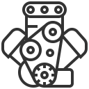

# JSPE

[](https://travis-ci.org/componentDidMount/jspe)
[](https://codeclimate.com/github/componentDidMount/jspe/test_coverage)
[](https://codeclimate.com/github/componentDidMount/jspe/maintainability)

JSPE is a JavaScript BPMN workflow execution engine.

## Goals

* [ ] Everything needs to be extensible. (Plugins)
* [ ] Vendor independent. (Understands various modeler's properties through
      plugins)
* [ ] Run in the browser and in node. (Browserify)
* [ ] Every variable value can also be a function which when executed returns
      'the value' to use.
* [ ] Needs to be able to execute a BPMN 2.0 workflow. (BPMN conformance)
* [ ] Be safe.
* [ ] Try to be fast.
* [ ] Optionally spawn child processes (on node) or workers (in the browser) to
      optimize the execution of the flow. (not sure yet)

## Install and use

First, install using npm or yarn

```sh
$ npm install jspe --save
```

Then use JSPE with Node.JS or in the browser.

##### To start a processInstance

```js
const JSPE = require('jspe');

// Instantiate an engine
const jspe = new JSPE();

// Create a new process instance, specify a valid bpmn definition (returns a token)
const token = await jspe
  .createProcessInstance({
    workflowDefinition: 'valid bpmn'
  }).catch(console.error);

// Tell the initial token to continue execution
await token.exec().catch(console.error);
```

##### To continue execution of a processInstance (by token)

```js
// At some later point in time, in a different part of
// your app (e.g. when a User task is handled as complete by your own app)
const token = await jspe.continueTokenInstance({
  tokenId: '<id of the token you want to execute>',
  // set the payload you want to merge into the existing payload
  payload: {}
});

await token.exec().catch(console.error);
```

## Currently supported flow objects

### Events:

* [x] Start
* [x] End
* [ ] IntermediateThrow
* [ ] MessageIntermediateThrow
* [ ] MessageIntermediateCatch
* [ ] MessageEnd
* [ ] TimerIntermediateCatch
* [ ] EscalationIntermediateThrow
* [ ] EscalationEnd
* [ ] ErrorEnd
* [ ] ConditionalIntermediateThrow
* [ ] LinkIntermediateCatch
* [ ] LinkIntermediateThrow
* [ ] CompensationIntermediateThrow
* [ ] CompensationEnd
* [ ] SignalIntermediateThrow
* [ ] SignalIntermediateCatch
* [ ] MessageStart
* [ ] TimerStart
* [ ] ConditionalStart
* [ ] SignalStart
* [ ] SignalEnd
* [ ] TerminateEnd

### Activities:

* [x] Task
* [x] Service
* [x] User
* [x] Manual
* [ ] Send
* [ ] Receive
* [ ] BusinessRule
* [ ] Script

### Gateways:

* [x] Exclusive
* [x] Inclusive
* [x] Parallel
* [ ] EventBased
* [ ] Complex

### Other:

* [x] Swimlanes
* [ ] CallActivity
* [x] SubProcess
* [x] Loop
* [x] ParallelMultiInstance
* [ ] SequentialMultiInstance

## Persistency layer

You can install one of the following packages to add persistency to the state of your processes.

* jspe-persist-mongoose
* jspe-persist-sequelize (supported dialects: mysql (MySQL 5.7.\*), postgres sqlite3)
* jspe-persist-redis

Use one of the persistency plugins in jspe

```js
const JSPE = require('jspe');
const PersistMongoose = require('jspe-persist-mongoose');

const persistMongoose = new PersistMongoose(<mongodb:url>);

const jspe = new JSPE({
  persist: persistMongoose,
});
```

## Develop JSPE

...

## Develop plugins

Currently you can develop plugins for the following elements:

* Element
* UserTask
* ServiceTask

You create plugins by extending from one of the above classes and instantiating a class into the plugins array when creating the engine.

```js
const JSPE = require('jspe');

class History extends JSPE.Plugins.Element {
  constructor({ store = [] } = {}) {
    super();
    this.store = store;
  }

  onReady = definition => {
    this.store.push({ state: 'ready', elementId: definition.id });
  };
  onActive = definition => {
    this.store.push({ state: 'active', elementId: definition.id });
  };
  onComplete = definition => {
    this.store.push({ state: 'complete', elementId: definition.id });
  };
}

const history = new History();

const jspe = new JSPE({ plugins: [history] });
```

The above plugin will push executed elements' id's into an array, which serves as some kind of log.

##### Plugin methods

Every plugin can make use of three methods which will be called in order of execution,
_onReady_, _onActive_ and _onComplete_.

##### Method arguments

Methods receive the definition (as a moddle reference) of the current activity
and the processInstance (including its .payload) as arguments. Read more about
creating plugins here (... link missing...).
